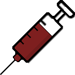
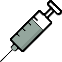
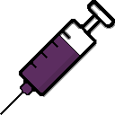

# Vaccines Project — Wiki

This document lists all vaccines in the mod with their defs and technical values.  
All vaccines below share the same base values (WorkToMake, workAmount, MarketValue, research baseCost, etc.).

## Overview (Quick Summary)

| Disease | Vaccine ThingDef | RecipeDef | ResearchProjectDef | Produced At | Ingredients |
|--------:|------------------:|----------:|-------------------:|-------------:|-------------:|
| [BloodRot](##BloodRot) | `Vaccine_BloodRot` | `Produce_Vaccine_BloodRot` | `Vaccines_Unlock_BloodRot` | Drug Lab | 1x HemogenPack, 2x Neutroamine |
| [Flu](##Flu) | `Vaccine_Flu` | `Produce_Vaccine_Flu` | `Vaccines_Unlock_Flu` | Drug Lab | 1x HemogenPack, 2x Neutroamine |
| [GutWorms](##GutWorms) | `Vaccine_GutWorms` | `Produce_Vaccine_GutWorms` | `Vaccines_Unlock_GutWorms` | Drug Lab | 1x HemogenPack, 2x Neutroamine |
| [Infection](##Infection) | `Vaccine_Infection` | `Produce_Vaccine_Infection` | `Vaccines_Unlock_Infection` | Drug Lab | 1x HemogenPack, 2x Neutroamine |
| [Malaria](##Malaria) | `Vaccine_Malaria` | `Produce_Vaccine_Malaria` | `Vaccines_Unlock_Malaria` | Drug Lab | 1x HemogenPack, 2x Neutroamine |
| [MuscleParasites](##MusclaParasites) | `Vaccine_MuscleParasites` | `Produce_Vaccine_MuscleParasites` | `Vaccines_Unlock_MuscleParasites` | Drug Lab | 1x HemogenPack, 2x Neutroamine |
| [OrganDecay](##OrganDecay) | `Vaccine_OrganDecay` | `Produce_Vaccine_OrganDecay` | `Vaccines_Unlock_OrganDecay` | Drug Lab | 1x HemogenPack, 2x Neutroamine |
| [Plague](##Plague) | `Vaccine_Plague` | `Produce_Vaccine_Plague` | `Vaccines_Unlock_Plague` | Drug Lab | 1x HemogenPack, 2x Neutroamine |
| [Scaria](##Scaria) | `Vaccine_Scaria` | `Produce_Vaccine_Scaria` | `Vaccines_Unlock_Scaria` | Drug Lab | 1x HemogenPack, 2x Neutroamine |

# Individual Vaccine Sections

## **Flu** 

### ThingDef
- `defName`: `Vaccine_Flu`
- Gives: `Vaccine_Flu_Immunity`
- WorkToMake: 1200  
- MarketValue: 6000  
- Mass: 0.03  
- stackLimit: 6  

### RecipeDef
- `defName`: `Produce_Vaccine_Flu`
- workAmount: 4000  
- Medicine skill 14  
- researchPrerequisite: `Vaccines_Unlock_Flu`  
- ingredients: 1 HemogenPack, 2 Neutroamine  
- product: 1 Vaccine_Flu  

### ResearchProjectDef
- `defName`: `Vaccines_Unlock_Flu`
- baseCost: 650  
- prerequisite: `Vaccines_Unlock`  

### HediffDef
- `defName`: `Vaccine_Flu_Immunity`
- makeImmuneTo: `Flu`

## **BloodRot**

### ThingDef
- `Vaccine_BloodRot`  
- Gives `Vaccine_BloodRot_Immunity`
- WorkToMake: 1200  
- MarketValue: 6000  
- Mass: 0.03  
- stackLimit: 6  

### RecipeDef
- `Produce_Vaccine_BloodRot`  
- workAmount: 4000  
- Medicine skill 14  
- researchPrerequisite: `Vaccines_Unlock_BloodRot`  
- ingredients: 1 HemogenPack, 2 Neutroamine  
- product: 1 Vaccine BloodRot

### ResearchProjectDef
- `Vaccines_Unlock_BloodRot`  
- baseCost: 650  
- prerequisite: `Vaccines_Unlock` 

### HediffDef
- `defName`: `Vaccine_BloodRot_Immunity`
- makeImmuneTo: `Blood Rot`

## **GutWorms**

### ThingDef
- `Vaccine_GutWorms`
- Gives `Vaccine_GutWorms_Immunity`
- WorkToMake: 1200  
- MarketValue: 6000  
- Mass: 0.03  
- stackLimit: 6  

### RecipeDef
- `Produce_Vaccine_GutWorms`
- workAmount: 4000  
- Medicine skill 14  
- researchPrerequisite: `Vaccines_Unlock_GutWorms`  
- ingredients: 1 HemogenPack, 2 Neutroamine  
- product: 1 Vaccine Gut Worms
  
### ResearchProjectDef
- `Vaccines_Unlock_GutWorms`  
- baseCost: 650  
- prerequisite: `Vaccines_Unlock`  

### HediffDef
- `defName`: `Vaccine_GutWorms_Immunity`
- makeImmuneTo: `Gut Worms`

## **Infection**

### ThingDef
- `Vaccine_Infection` 
- Gives `Vaccine_Infection_Immunity`
- WorkToMake: 1200  
- MarketValue: 6000  
- Mass: 0.03  
- stackLimit: 6  

### RecipeDef
- `Produce_Vaccine_Infection`
- workAmount: 4000  
- Medicine skill 14  
- researchPrerequisite: `Vaccines_Unlock_Infection`  
- ingredients: 1 HemogenPack, 2 Neutroamine  
- product: 1 Vaccine Wound Infection
  
### ResearchProjectDef
- `Vaccines_Unlock_Infection`  
- baseCost: 650  
- prerequisite: `Vaccines_Unlock`  

### HediffDef
- `defName`: `Vaccine_Infection_Immunity`
- makeImmuneTo: `Wound Infection`

## **Malaria**

### ThingDef
- `Vaccine_Malaria`  
- Gives `Vaccine_Malaria_Immunity`
- WorkToMake: 1200  
- MarketValue: 6000  
- Mass: 0.03  
- stackLimit: 6

### RecipeDef
- `Produce_Vaccine_Malaria`
- workAmount: 4000  
- Medicine skill 14  
- researchPrerequisite: `Vaccines_Unlock_Malaria`  
- ingredients: 1 HemogenPack, 2 Neutroamine  
- product: 1 Vaccine Malaria
  
### ResearchProjectDef
- `Vaccines_Unlock_Malaria`  
- baseCost: 650  
- prerequisite: `Vaccines_Unlock`  

### HediffDef
- `defName`: `Vaccine_Malaria_Immunity`
- makeImmuneTo: `Malaria`

## **Muscle Parasites**

### ThingDef
- `Vaccine_MuscleParasites`  
- Gives `Vaccine_MuscleParasites_Immunity`
- WorkToMake: 1200  
- MarketValue: 6000  
- Mass: 0.03  
- stackLimit: 6

### RecipeDef
- `Produce_Vaccine_MuscleParasites`
- workAmount: 4000  
- Medicine skill 14  
- researchPrerequisite: `Vaccines_Unlock_MuscleParasites`  
- ingredients: 1 HemogenPack, 2 Neutroamine  
- product: 1 Vaccine Muscle Parasites

### ResearchProjectDef
- `Vaccines_Unlock_MuscleParasites`  
- baseCost: 650  
- prerequisite: `Vaccines_Unlock`  

### HediffDef
- `defName`: `Vaccine_MuscleParasites_Immunity`
- makeImmuneTo: `Muscle Parasites`

## **Organ Decay**

### ThingDef
- `Vaccine_OrganDecay`
- Gives `Vaccine_OrganDecay_Immunity`
- WorkToMake: 1200  
- MarketValue: 6000  
- Mass: 0.03  
- stackLimit: 6

### RecipeDef
- `Produce_Vaccine_OrganDecay`
- workAmount: 4000  
- Medicine skill 14  
- researchPrerequisite: `Vaccines_Unlock_OrganDecay`  
- ingredients: 1 HemogenPack, 2 Neutroamine  
- product: 1 Vaccine Organ Decay

### ResearchProjectDef
- `Vaccines_Unlock_OrganDecay`  
- baseCost: 650  
- prerequisite: `Vaccines_Unlock`  

### HediffDef
- `defName`: `Vaccine_OrganDecay_Immunity`
- makeImmuneTo: `Organ Decay`

## **Plague**

### ThingDef
- `Vaccine_Plague`
- Gives `Vaccine_Plague_Immunity`
- WorkToMake: 1200  
- MarketValue: 6000  
- Mass: 0.03  
- stackLimit: 6
  
### RecipeDef
- `Produce_Vaccine_Plague`  
- workAmount: 4000  
- Medicine skill 14  
- researchPrerequisite: `Vaccines_Unlock_Plague`  
- ingredients: 1 HemogenPack, 2 Neutroamine  
- product: 1 Vaccine Plague

### ResearchProjectDef
- `Vaccines_Unlock_Plague`  
- baseCost: 650  
- prerequisite: `Vaccines_Unlock`  

### HediffDef
- `defName`: `Vaccine_Plague_Immunity`
- makeImmuneTo: `Plague`

## **Scaria**

### ThingDef
- `Vaccine_Scaria`
- Gives `Vaccine_Scaria_Immunity`
- WorkToMake: 1200  
- MarketValue: 6000  
- Mass: 0.03  
- stackLimit: 6
  
### RecipeDef
- `Produce_Vaccine_Scaria`  
- workAmount: 4000  
- Medicine skill 14  
- researchPrerequisite: `Vaccines_Unlock_Scaria`  
- ingredients: 1 HemogenPack, 2 Neutroamine  
- product: 1 Vaccine Scaria

### ResearchProjectDef
- `Vaccines_Unlock_Scaria`  
- baseCost: 650  
- prerequisite: `Vaccines_Unlock`  

### HediffDef
- `defName`: `Vaccine_Scaria_Immunity`
- makeImmuneTo: `Scaria`

*Updated to the version: 0.5*
